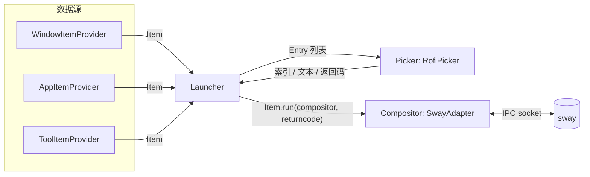

# waylaunch

[English](README.md) | 中文

一个可插拔的 Wayland 应用启动器——一个快捷键，三种数据源（打开的窗口、桌面应用、自定义工具），
任意选择器 UI，任意合成器。


## 为什么

大多数 Wayland 启动器都把选择器（rofi、wofi、fuzzel……）和数据源（通常只有 `drun`）写死在代码里。
waylaunch 则定义了三个小接口——**Provider**（数据源）、**Picker**（选择器）、**Compositor**（合成器）
——让你在一份配置文件里自由组合。目前已实现：

- **Provider（数据源）**：`window`（当前打开的窗口）、`drun`（已安装的 `.desktop` 应用）、
  `tool`（你自己写的 shell 命令，按分组组织，在 TOML 里配置）
- **Picker（选择器）**：`rofi`（通过它的 `-dmenu` 脚本协议）
- **Compositor（合成器）**：`sway`（从零实现的异步 IPC 客户端，热路径上不调用 `swaymsg` 子进程）

没有对应适配器的场景会优雅降级——不支持的合成器会落到一个什么都不做的 `NullAdapter`，
而不是直接崩溃。

> **现状**：这是一个自用的日常工具，还不是打磨过的 1.0。架构上刻意做得比较通用
> （见[扩展](#扩展)），但目前只有一个选择器实现和一个合成器实现。还没有测试——
> 见[贡献](#贡献)。

## 特性

- **统一的启动列表**：窗口、应用、临时工具全部合并在一个列表里，模糊匹配，单一快捷键触发。
- **插件化设计**：`Provider` / `Picker` / `Compositor` 都是 `typing.Protocol`，
  通过一个基于装饰器的小型注册表（`@registry.register("name")`）发现，
  同时也支持标准的 Python [entry points](#扩展) 来加载树外插件。
- **布局主题**：`menu`（列表）、`board`（网格，尺寸根据条目数量自动计算）、
  `launchpad`（全屏网格）——每种都对应一个由你掌控的 rofi `.rasi` 主题。
- **感知工作区的启动方式**：绑定一个自定义键（rofi 的 `-kb-custom-N`），
  可以让选中的应用直接开在第一个空闲工作区，而不是当前工作区——
  见[自定义按键动作](#自定义按键动作)。
- **配置分层**：命令行参数 > `~/.config/waylaunch/config.toml` > 内置默认值，
  全程用 Pydantic 做校验。
- **健壮的 Sway 后端**：通过 IPC 事件订阅维护窗口/工作区状态（不轮询），
  Sway 重启时按带抖动的指数退避自动重连。
- **出错就吵，不会闷声挂掉**：未捕获的异常会记录到滚动日志文件，
  并（可选）通过 `notify-send` 弹出桌面通知——毕竟是从快捷键触发的，
  静默死掉的话根本发现不了。

## 依赖环境

- Python 3.12+
- [`rofi`](https://github.com/davatorium/rofi) —— 目前唯一实现的 `Picker` 后端
- [Sway](https://swaywm.org/) —— 目前唯一实现的 `Compositor` 适配器；
  其他合成器仍能运行，只是没有窗口列表和感知工作区的启动能力（走 `NullAdapter`）
- `gio`（`glib2` 的一部分，几乎所有 Linux 桌面都自带）—— 用来启动 `.desktop` 条目，
  这样 `%f`/`%U` 这类字段码能被正确处理，而不用自己手写解析
- `notify-send` —— 可选；缺失时错误通知会被直接跳过，不影响主流程

## 安装

```sh
git clone <this-repo> waylaunch
cd waylaunch
uv tool install -e .
```

这会在你的 `PATH` 里注册一个 `waylaunch` 可执行命令（通过 `[project.scripts]`）。
`-e` 保持可编辑安装，`src/` 下的改动立即生效，不需要重新安装。

## 快速上手

```sh
waylaunch                                     # 默认：窗口 + 应用
waylaunch --provider window                   # 只显示已打开的窗口
waylaunch --provider drun --layout launchpad  # 应用，全屏网格样式
waylaunch --provider tool --layout board      # 自定义工具，网格样式
```

绑定到合成器快捷键，比如在 `sway` 配置里：

```
bindsym $mod+Space exec waylaunch
```

完整参数说明见 `waylaunch --help`。

## 配置

所有命令行参数都有对应的配置文件写法。默认值定义在
[`src/waylaunch/core/models.py`](src/waylaunch/core/models.py)；
优先级：命令行参数 > 配置文件 > 内置默认值。

`~/.config/waylaunch/config.toml`：

```toml
[provider]
# 列表形式："name" 或 "name:group1,group2" 用于限定加载哪些 tool 分组
plugins = ["window", "drun", "tool:misc,screenshot"]

[compositor]
plugins = ["sway"]

[picker]
plugins = ["rofi"]
prompt = "Launcher"
layout = "menu"          # menu | board | launchpad
align_max_len = 25       # menu 布局下副标题对齐的列宽
board_max_cols = 5
board_max_lines = 3

[picker.themes]           # rofi -theme 的名称，由 rofi 自己去解析
menu = "menu"
board = "board"
launchpad = "launchpad"

[picker.keybindings]
custom_1 = ["shift+Return"]  # 见下方"自定义按键动作"

[logging]
level = "INFO"
handlers = ["file", "notify_send"]

[logging.file]
path = "/tmp/waylaunch.log"
max_bytes = 10485760
backup_count = 5

[logging.notify_send]
level = "ERROR"
```

`~/.config/waylaunch/tools.toml` —— 任意命令，按表名分组，通过 `tool:<group>` 选择：

```toml
[[tool.misc]]
name = "Color Picker"
icon = "fa-eye-dropper"
run  = "grimpicker --copy"

[[tool.power]]
name = "Lock"
icon = "fa-lock"
run  = "swaylock -f"
```

> **注意**：`picker.themes` 下 `menu`/`board`/`launchpad` 这几个值会直接传给 rofi 的
> `-theme` 参数——你需要在 rofi 的主题搜索路径（比如 `~/.config/rofi/themes/`）里
> 准备好对应的 `.rasi` 文件，这个包本身不附带任何主题文件。

### 自定义按键动作

Rofi 的 `-dmenu` 模式会把 `-kb-custom-N` 映射成退出码 `10 + N`。waylaunch 的 provider
可以根据这个返回码分支处理——目前 `drun` 的 `AppItem.run()` 会检查返回码是否为 `10`，
如果是就改用 `compositor.first_empty_workspace()` 而不是当前聚焦的工作区来启动：

```python
async def run(self, compositor: Compositor, returncode: int = 0) -> None:
    ...
    if returncode == 0:
        await compositor.exec([cmd])
    elif returncode == 10:
        target_ws = await compositor.first_empty_workspace()
        await compositor.exec([cmd], str(target_ws))
```

按上面那样配置 `custom_1 = ["shift+Return"]` 之后：**Enter** 在当前工作区打开应用，
**Shift+Enter** 在第一个空闲工作区打开。`custom_2`/`custom_3` 用同样的方式对应退出码
11/12，留给你（或者新写一个 provider）另作他用。这个做法完全绕开了 rofi 自己的 `drun`
模式——waylaunch 始终通过 `-dmenu` 驱动 rofi，所以每一次按键都由自己接管，不依赖 `drun`
模式里那些可能失效的内置键位（比如 `kb-accept-alt`）。

## 架构



- **`core/protocols.py`** 定义了三个接口：`ItemProvider`（产出 `Item`，并知道如何把它渲染成
  `Entry`）、`Picker`（渲染 `Entry` 列表，返回用户的选择）、`Compositor`（窗口/工作区状态与操作）。
- **`core/registry.py`** 是一个约 40 行的装饰器注册表；给类加上
  `@registry.register("sway")` 后，会用 `issubclass` 对比运行时可检查的 `Protocol`，
  判断它满足哪个接口，然后归入对应的桶里。
- **`core/launcher.py`** 是唯一把三者串起来的地方：从每个配置的 provider 收集条目 →
  把 `Entry` 交给 picker 显示 → 把用户选择匹配回对应的 `Item` → 调用
  `Item.run(compositor, returncode)`。
- **`plugins/compositor/sway/client.py`** 是一个自成一体的异步 Sway IPC 客户端：
  二进制帧解析、单连接上的 FIFO 请求/响应多路复用、用 `@client.on("event")`
  装饰器做事件路由，以及连接断开时带抖动退避的自动重连。

## 扩展

想加一个新的 provider、picker 或 compositor，只需要在 `core/protocols.py` /
`compositor/compositor.py` 里实现对应的 `Protocol`，然后注册它：

```python
from waylaunch.core.registry import registry
from waylaunch.core.protocols import Entry, Item, ItemProvider

@registry.register("my-provider")
class MyItemProvider(ItemProvider[Item]):
    async def items(self, config, compositor) -> list[Item]:
        ...

    def to_entry(self, item: Item) -> Entry:
        return Entry(title=item.name, icon=item.icon)
```

树内插件由 `plugins/load_plugins()` 直接导入加载。树外插件走同样的路径，
通过标准的 Python entry points 发现——在你的插件包的 `pyproject.toml` 里声明：

```toml
[project.entry-points."waylaunch.plugins.provider"]
my-provider = "my_package.module"
```

（合法的组名：`waylaunch.plugins.provider`、`waylaunch.plugins.picker`、
`waylaunch.plugins.compositor`。）`load_plugins()` 只需要*导入*这个模块——
`@registry.register(...)` 装饰器会在导入时自动完成剩下的注册工作。

## 开发

类型检查和 lint 已经配置好，但还没接入 CI：

```sh
uv sync --group dev
uv run mypy .        # strict 模式
uv run ruff check .  # pycodestyle、bugbear、bandit、perflint……
```

## 贡献

欢迎 issue 和 PR，尤其是：

- 更多 `Compositor` 适配器（Hyprland 等），遵循同一套接口
- 更多 `Picker` 后端（wofi、fuzzel、dmenu）
- 一套测试（目前一个都没有）

## 许可证

[MIT](LICENSE)
