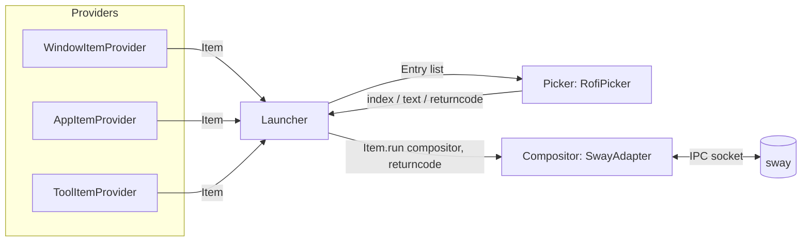

# waylaunch

English | [中文](README-CN.md)

A pluggable Wayland application launcher — one keybinding, three data sources
(open windows, desktop apps, custom tools), any picker UI, any compositor.


## Why

Most Wayland launchers hardcode one picker (rofi, wofi, fuzzel, ...) and one
data source (usually just `drun`). waylaunch instead defines three small
protocols — **Provider**, **Picker**, **Compositor** — and lets you mix and
match them from a single config file. Today it ships:

- **Providers**: `window` (currently open windows), `drun` (installed
  `.desktop` apps), `tool` (your own shell snippets, grouped and configurable
  in TOML)
- **Picker**: `rofi` (via its `-dmenu` scripting protocol)
- **Compositor**: `sway` (a from-scratch async IPC client, no `swaymsg`
  subprocess calls on the hot path)

Anything not matched by an installed adapter degrades gracefully — an
unsupported compositor falls back to a no-op `NullAdapter` instead of
crashing.

> **Status**: a personal daily-driver tool, not a polished 1.0. The
> architecture is deliberately generic (see [Extending](#extending)), but
> only one picker and one compositor backend exist today. No test suite yet —
> see [Contributing](#contributing).

## Features

- **Unified launcher** for windows, apps, and ad-hoc tools in one list —
  fuzzy-matched, single keybinding.
- **Pluggable by design**: `Provider` / `Picker` / `Compositor` are
  `typing.Protocol`s, discovered through a small decorator-based registry
  (`@registry.register("name")`) plus standard Python
  [entry points](#extending) for out-of-tree plugins.
- **Layout themes**: `menu` (list), `board` (grid, size auto-computed from
  item count), `launchpad` (fullscreen grid) — each maps to a rofi `.rasi`
  theme you control.
- **Workspace-aware launching**: bind a custom key (rofi's `-kb-custom-N`) to
  open the selected app straight into the first empty workspace instead of
  the current one — see [Custom key actions](#custom-key-actions).
- **Config layering**: CLI args > `~/.config/waylaunch/config.toml` >
  built-in defaults, validated end-to-end with Pydantic.
- **Resilient Sway backend**: maintains window/workspace state via IPC event
  subscriptions (no polling), with jittered exponential-backoff
  auto-reconnect if Sway restarts.
- **Fails loud, not hard**: uncaught exceptions are logged to a rotating file
  and (optionally) surfaced as a desktop notification via `notify-send`,
  instead of dying silently when invoked from a keybinding.

## Requirements

- Python 3.12+
- [`rofi`](https://github.com/davatorium/rofi) — the only `Picker` backend
  implemented so far
- [Sway](https://swaywm.org/) — the only `Compositor` adapter implemented so
  far; other compositors still run, just without window listing or
  workspace-aware launching (`NullAdapter`)
- `gio` (part of `glib2`, present on virtually every Linux desktop) — used to
  launch `.desktop` entries so `%f`/`%U`-style field codes are handled
  correctly instead of being hand-parsed
- `notify-send` — optional; error notifications are simply skipped if it's
  missing

## Install

```sh
git clone <this-repo> waylaunch
cd waylaunch
uv tool install -e .
```

This registers a `waylaunch` executable (via `[project.scripts]`) on your
`PATH`. `-e` keeps it editable, so changes under `src/` take effect
immediately without reinstalling.

## Quick start

```sh
waylaunch                                     # default: windows + apps
waylaunch --provider window                   # only open windows
waylaunch --provider drun --layout launchpad  # apps, fullscreen grid
waylaunch --provider tool --layout board      # custom tools, grid
```

Wire it to a compositor keybinding, e.g. in `sway`'s config:

```
bindsym $mod+Space exec waylaunch
```

Run `waylaunch --help` for the full flag reference.

## Configuration

All flags have a config-file equivalent. Defaults live in
[`src/waylaunch/core/models.py`](src/waylaunch/core/models.py); CLI flags
always win over the file, which wins over built-in defaults.

`~/.config/waylaunch/config.toml`:

```toml
[provider]
# List form: "name" or "name:group1,group2" to scope which tool groups load
plugins = ["window", "drun", "tool:misc,screenshot"]

[compositor]
plugins = ["sway"]

[picker]
plugins = ["rofi"]
prompt = "Launcher"
layout = "menu"          # menu | board | launchpad
align_max_len = 25       # subtitle alignment column in `menu` layout
board_max_cols = 5
board_max_lines = 3

[picker.themes]           # rofi -theme names, resolved by rofi itself
menu = "menu"
board = "board"
launchpad = "launchpad"

[picker.keybindings]
custom_1 = ["shift+Return"]  # see "Custom key actions" below

[logging]
level = "INFO"
handlers = ["file", "notify_send"]

[logging.file]
path = "/tmp/waylaunch.log"
max_bytes = 10485760
backup_count = 5

[logging.notify_send]
level = "ERROR"
```

`~/.config/waylaunch/tools.toml` — arbitrary commands, grouped by table name
and selectable via `tool:<group>`:

```toml
[[tool.misc]]
name = "Color Picker"
icon = "fa-eye-dropper"
run  = "grimpicker --copy"

[[tool.power]]
name = "Lock"
icon = "fa-lock"
run  = "swaylock -f"
```

> **Note**: the `menu`/`board`/`launchpad` values under `picker.themes` are
> passed straight to rofi's `-theme` flag — you need matching `.rasi` files
> in rofi's theme search path (e.g. `~/.config/rofi/themes/`). None are
> bundled with this package.

### Custom key actions

Rofi's `-dmenu` mode maps `-kb-custom-N` to exit code `10 + N`. waylaunch's
providers can branch on that returncode — right now `drun`'s `AppItem.run()`
checks for `10` and launches into `compositor.first_empty_workspace()`
instead of the focused one:

```python
async def run(self, compositor: Compositor, returncode: int = 0) -> None:
    ...
    if returncode == 0:
        await compositor.exec([cmd])
    elif returncode == 10:
        target_ws = await compositor.first_empty_workspace()
        await compositor.exec([cmd], str(target_ws))
```

Binding `custom_1 = ["shift+Return"]` as above turns this on: **Return**
opens the app on the current workspace, **Shift+Return** opens it in the
first empty one. `custom_2`/`custom_3` are wired the same way for exit codes
11/12, free for you (or a new provider) to use for something else. This
sidesteps rofi's own `drun` mode entirely — waylaunch always drives rofi
through `-dmenu`, so it owns every keypress.

## Architecture



- **`core/protocols.py`** defines the three seams: `ItemProvider` (produces
  `Item`s + how to render them as an `Entry`), `Picker` (renders `Entry`s,
  returns a selection), `Compositor` (window/workspace state + actions).
- **`core/registry.py`** is a ~40-line decorator-based registry;
  `@registry.register("sway")` on a class inspects which protocol it
  satisfies (via `issubclass` against runtime-checkable `Protocol`s) and
  files it under the right bucket.
- **`core/launcher.py`** is the only place that ties them together: collect
  items from every configured provider → hand `Entry`s to the picker → match
  the selection back to its `Item` → call `Item.run(compositor, returncode)`.
- **`plugins/compositor/sway/client.py`** is a self-contained async Sway IPC
  client: binary framing, FIFO request/response multiplexing over one
  connection, an `@client.on("event")` decorator for event routing, and
  auto-reconnect with jittered backoff if the socket drops.

## Extending

Add a new provider, picker, or compositor by implementing the matching
`Protocol` in `core/protocols.py` / `compositor/compositor.py` and
registering it:

```python
from waylaunch.core.registry import registry
from waylaunch.core.protocols import Entry, Item, ItemProvider

@registry.register("my-provider")
class MyItemProvider(ItemProvider[Item]):
    async def items(self, config, compositor) -> list[Item]:
        ...

    def to_entry(self, item: Item) -> Entry:
        return Entry(title=item.name, icon=item.icon)
```

In-tree plugins are imported eagerly by `plugins/load_plugins()`. Out-of-tree
plugins are picked up the same way, via standard Python entry points —
declare yours in the plugin package's `pyproject.toml`:

```toml
[project.entry-points."waylaunch.plugins.provider"]
my-provider = "my_package.module"
```

(Valid groups: `waylaunch.plugins.provider`, `waylaunch.plugins.picker`,
`waylaunch.plugins.compositor`.) `load_plugins()` only needs to *import* the
module — the `@registry.register(...)` decorator does the rest at import
time.

## Development

Type checking and linting are configured but not yet wired into CI:

```sh
uv sync --group dev
uv run mypy .        # strict mode
uv run ruff check .  # pycodestyle, bugbear, bandit, perflint, ...
```

## Contributing

Issues and PRs welcome — in particular:

- Additional `Compositor` adapters (Hyprland, etc.) behind the same protocol
- Additional `Picker` backends (wofi, fuzzel, dmenu)
- A test suite (none exists yet)

## License

[MIT](LICENSE)
